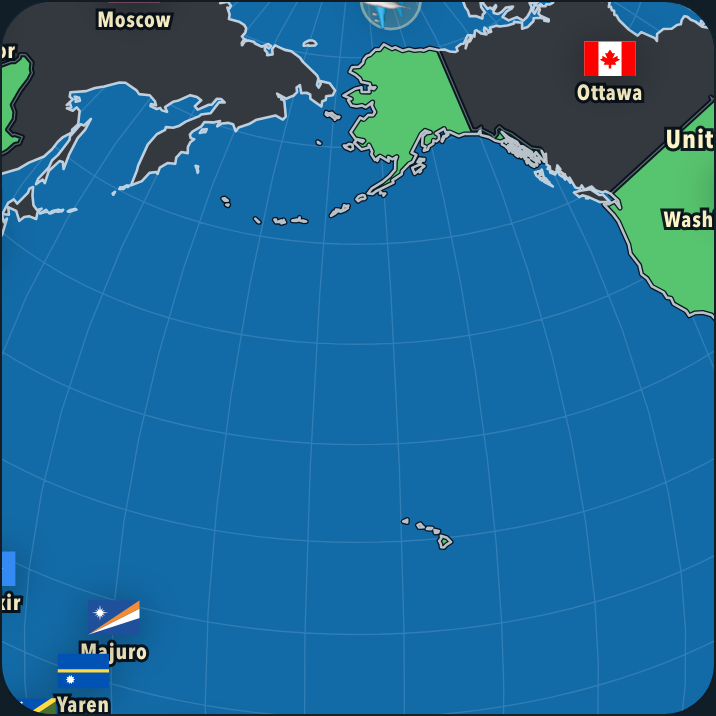
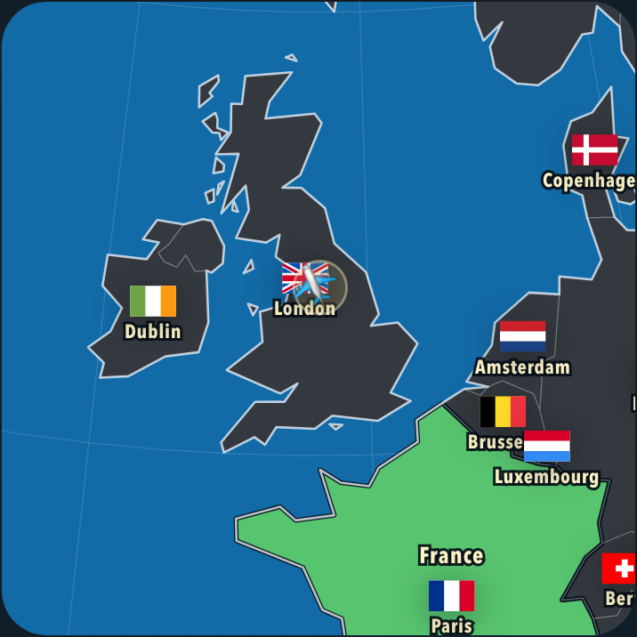
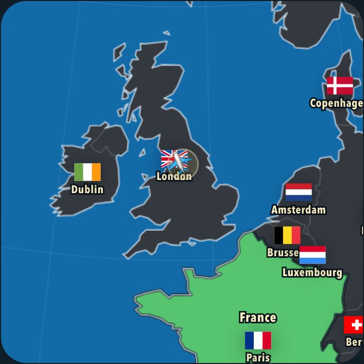

# Adaptive rendering experiments

Experiments on `codex/adaptive-rendering-experiments`, based on main `88d9ef8`, 10 September 2026. Every renderer change is opt-in through a query parameter. A normal URL retains the shipped rendering policy.

FPS-based selection of SVG geometry produced the best performance improvement tested. Lower-resolution bitmap rendering did not beat the existing SVG renderer. However, the extra geometry simplification visibly changes coastlines, especially close to Europe. **Keep the current production renderer for now:** these prototypes do not achieve a 30% overall improvement without a visible compromise. The branch provides reproducible comparisons for the actual old phone.

## Controlled comparison

Production build, Chromium 145.0.7632.6 on an Apple M4, 390 × 844 CSS-pixel viewport, device pixel ratio 2, CPU throttled 6×. Each variant ran the same five routes three times after two warmup flights: GBR → USA → CHN → USA → AUS → GBR. Each flight lasts 1.7 seconds. Runs were sequential, without overlapping builds or browser tests. Overall FPS is weighted by sampled frame time, rather than an average of route FPS.

| Flight renderer | Overall FPS | USA → China FPS | 95th-percentile frame interval |
| --- | ---: | ---: | ---: |
| Current SVG geometry | 29.04 | 18.72 | 66.7 ms |
| Canvas, native backing resolution | 18.92 | 11.24 | 100.2 ms |
| Canvas, 75% width and height | 19.63 | 11.78 | 100.1 ms |
| Canvas, 50% width and height | 21.07 | 13.04 | 83.9 ms |
| SVG, existing coarser interaction geometry | 31.43 | 22.92 | 50.6 ms |
| SVG, coarser geometry preserving small islands | 31.06 | 21.15 | 50.8 ms |
| Adaptive SVG, preserving small islands | 31.47 | 21.72 | 50.8 ms |

Adaptive SVG improved overall FPS by 8.4% and USA → China by 16.0%. Warmup flights had already selected the coarser geometry, so the small difference between fixed and adaptive versions is run variability, not an extra controller speedup. The difficult flight still falls below 30 FPS.

Halving both bitmap dimensions means drawing one quarter of the pixels. That improved the canvas prototype by 11.4% compared with native-resolution canvas, but remained 27.5% slower than current SVG overall. The prototype still performs the original spherical projection, clipping and path construction; mean synchronous render time remained around 31–33 ms across canvas resolutions. Lower pixel count does not remove that CPU work.

On the unthrottled M4, current SVG and adaptive SVG both delivered about 59.8 FPS, with the adaptive controller retaining standard geometry throughout. For comparison, forcing full geometry during flights delivered 48.8 FPS overall and 38.6 FPS for USA → China. The final adaptive policy therefore retains the shipped flight detail on fast devices rather than automatically probing full geometry.

Two-repeat follow-ups also found:

| Scenario | Current SVG | Comparison renderer | USA → China, current → comparison |
| --- | ---: | ---: | ---: |
| DPR 3, CPU 6×, native canvas | 28.38 FPS | 16.55 FPS | 17.88 → 9.08 FPS |
| DPR 3, CPU 6×, half-resolution canvas | 28.38 FPS | 20.25 FPS | 17.88 → 11.94 FPS |
| 100 answered countries, CPU 6×, adaptive SVG | 21.51 FPS | 24.75 FPS | 13.20 → 16.82 FPS |

The late-game adaptive improvement was 15.1% overall and 27.4% for USA → China. These results reinforce the same direction, while also showing that the hard late-game route still needs substantially more work to reach 30 FPS.

Per-route results, repeat-to-repeat values, timing tails and selected detail counts are in [results.json](render-experiments/results.json). Raw frame samples are generated under `output/playwright/experiment-*.json` and are ignored by Git.

## What the prototypes do

| Query parameter | Behavior during a globe flight |
| --- | --- |
| `renderExperiment=svg-standard` | Instrumented control using the shipped flight geometry |
| `renderExperiment=svg-full` | Full settled-map geometry throughout the flight |
| `renderExperiment=svg-coarse` | Reuses the smaller interaction atlas for visible geometry |
| `renderExperiment=svg-islands` | Coarser atlas with small rings restored from the standard atlas |
| `renderExperiment=svg-adaptive` | Uses measured frame intervals to choose standard or island-preserving coarse geometry |
| `renderExperiment=canvas-100` | Actual HTML canvas at native device-pixel resolution |
| `renderExperiment=canvas-75` | Canvas at 75% of native width and height, scaled to the same display size |
| `renderExperiment=canvas-50` | Canvas at 50% of native width and height, scaled to the same display size |
| `renderExperiment=canvas-50-full` | Optional diagnostic combining full geometry with half-resolution canvas; not included in the comparison |

The canvas prototype draws the same ordered map paths through `Path2D`. It avoids rewriting the hidden static SVG paths during flight and reuses matching land/coastline paths within each frame. Labels, flags, the plane and hit testing remain in SVG. Canvas applies only to orthographic flights; flat projections and the settled map use the existing SVG renderer. This tests a concrete bitmap conversion using the existing projection pipeline, not every possible Canvas or WebGL architecture. The recorded raster submission time excludes asynchronous GPU work.

The adaptive controller starts at standard detail. Two consecutive measured frame intervals over 38 ms lower it to the coarser geometry. It ignores hidden-page samples, invalid timings and gaps longer than 250 ms. It never increases detail within a flight. After a completed flight with at least 20 usable samples, 90th-percentile frame time below 27 ms and render CPU time below 14 ms permit a return to standard detail on the next flight. Cancellation cannot promote detail. Its learned preference lasts for the page session; it does not identify the CPU or collect hardware information.

The island variant reuses both atlases already downloaded by the app. It restores entire shared arcs belonging to rings with at most 16 vertices in the standard atlas, preserving those rings exactly without introducing cracks between country fills, coastlines and borders. The resulting atlas has 11,911 arc vertices, versus 19,258 standard and 10,054 coarse. Tests verify 2,792 small-ring occurrences across land and country objects; these are not 2,792 distinct islands.

## Visual tradeoffs

Half-resolution canvas visibly softens coastlines and graticules in the captures. Text, flags and the plane remain sharp. The original coarse atlas makes larger coastlines more angular and drops some small islands. Preserving small rings addresses those disappearing shapes, while larger coastlines still differ from the shipped flight geometry. Neither prototype should be described as visually identical during flight.

The screenshot script captures wide Pacific, European, Caribbean and settled views at identical animation times. It checks exact equality of the complete labels/flags/plane SVG across variants. All variants restore the full map at rest. The local contact sheet is generated at `output/playwright/render-experiments-visual/index.html`.

| Current flight geometry | Coarser geometry, small islands preserved | Half-resolution canvas |
| --- | --- | --- |
|  |  |  |
|  |  |  |

## Reproduce

Validation on this branch passed the production build and policy/topology checks. With experiments disabled, Playwright compared 150 SVG states and 66 screenshots against the starting revision across desktop, mobile, 100-answer, overview, route, Mercator and Equal Earth scenarios: all SVG states and pixels matched. The experiment lifecycle check compares 32 settled SVG states exactly after landing, zoom/pointer interruption, drag, projection change and resize. The seven fixed visual variants have 28 captures with identical labels/flags/plane overlays.

Use Node 22.18+ for the direct TypeScript policy tests, and install Playwright Chromium if it is not already available.

```sh
npm ci
npx playwright install chromium
npm run build
node scripts/verify-adaptive-detail.mjs
node scripts/benchmark-render-experiments.mjs
MATRIX=fast node scripts/benchmark-render-experiments.mjs
MATRIX=dense node scripts/benchmark-render-experiments.mjs
MATRIX=solved node scripts/benchmark-render-experiments.mjs
node scripts/summarize-render-experiments.mjs
node scripts/experiment-render-visuals.mjs
node scripts/verify-render-experiments.mjs
```

The visual script caches the app's pinned flag assets through `npm pack` on its first run. Run visual checks separately from timing benchmarks. `MATRIX=all` runs all four performance groups sequentially. The dense group uses DPR 3; the solved group seeds 100 real answers through the quiz input.

To compare ordinary URLs against the starting revision, save a production build of `88d9ef8` first, then run:

```sh
FRESH_RASTER=1 VISUAL_OUTPUT=output/playwright/experiment-default-visual \
  node scripts/verify-globe-rendering.mjs output/playwright/adaptive-experiment-baseline dist
```

## Limits and recommendation

CPU throttling on an M4 does not reproduce an old phone's GPU, memory bandwidth, temperature, browser or battery behavior. These numbers establish the relative behavior of these prototypes on this host; they are not a promised phone speedup. Flight FPS measures moving frame intervals, not final landing redraw latency. Separate lifecycle checks cover full-detail restoration after landing and interruption.

Keep the existing production renderer. FPS measurement is useful, but the tested extra simplification is too visible to present as a fidelity-preserving improvement. The next geometry experiment should limit visible error at the current zoom, especially near a destination, rather than apply this coarse atlas at every scale.

Use this branch to compare the bitmap variants on the actual old phone: a device limited by pixel painting may respond differently. If preserving every coastline detail remains mandatory, these experiments have not produced a qualifying replacement. A larger rendering change that reduces projection and path-construction work would need its own measurements.
