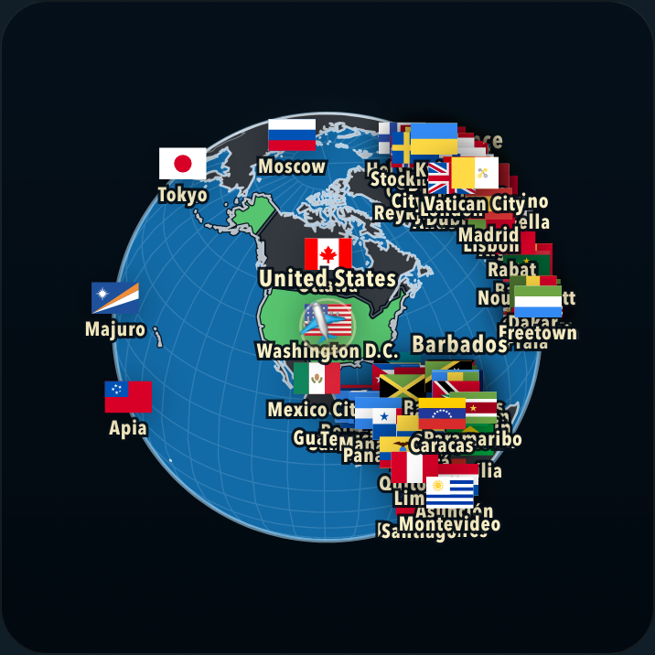

# Whole-planet rendering experiment

The new prototype roughly doubles FPS at a fixed whole-planet view, with matching screenshots. It combines the previous one-pixel zoom-dependent geometry with a faster orthographic projection. The additional gain comes from reusing 3D coordinates, without further simplifying the map or reducing bitmap resolution.

The measured combination is now the default flight renderer, with full detail restored after landing. The measurements below were collected on `codex/adaptive-rendering-experiments` before promotion. Explicit experiment URLs remain available for comparisons; normal play does not collect experiment telemetry.

The production rollout also includes remote main's saved-game change (`7dcb4c4`). Normal play matched the opt-in renderer across **150 exact SVG states and 66 pixel-identical screenshots**, including desktop, mobile, 100 answered countries, overview, route mode, Mercator and Equal Earth. Reload/resume, starting a new quiz, answer acceptance and full-detail landing passed the production smoke test. [Rendering checks](whole-planet/production-verification.json), [smoke checks](whole-planet/production-smoke.json).

## Measured results

Chrome 145.0.7632.6 on an Apple M4, CPU throttled 6×, 390 × 844 viewport, DPR 2. Routes: GBR → USA → CHN → USA → AUS → GBR. Every measured flight holds the projection scale at 117.15795 CSS pixels throughout.

| Renderer | Whole-planet FPS | USA → China FPS | JavaScript render time/frame |
|---|---:|---:|---:|
| Existing flight renderer | 16.6 | 14.9 | 51.6 ms |
| Previous one-pixel zoom detail | 24.1 | 22.7 | 34.8 ms |
| Zoom detail + cached 3D projection | **33.6** | **31.5** | **23.7 ms** |

The combined prototype improves overall FPS by **102%** against the existing renderer and **39%** against zoom-dependent detail alone. Each variant has 20 measured flights, split between two runs in reversed order. The new variant measured 33.64 and 33.61 FPS in those runs. Builds, other browser tests and geometry verification were kept out of the measured batches. [Results](whole-planet/overview.json).

With **100 countries answered**, the new projection improves the previous zoom-detail experiment from **18.6 to 25.4 FPS** (+37%). USA → China improves from 17.4 to 23.4 FPS. This smaller follow-up uses ten flights per variant in one order. [Results](whole-planet/solved.json).

The earlier “whole planet” experiment only **started** at minimum zoom, then zoomed in during each flight. Its blended FPS understated the gain at a sustained overview. These new numbers apply to the fixed overview; they do not predict the same gain during a normal flight that zooms into its destination.

## Why simpler coastlines were not enough

The diagnostic profile showed that the existing renderer spent approximately 17 ms/frame on land, 9 ms on the sphere/grid, 6.5 ms on borders, 5.7 ms on tiny-country outlines and 11.9 ms on labels. After zoom-dependent detail reduced coastline work, label projection and the other unchanged layers accounted for most of the remaining CPU time. [Diagnostic stage timings](whole-planet/profiling.json).

Orthographic projection is linear in a point's three-dimensional unit-sphere coordinates. The prototype prepares those coordinates once and uses a small matrix calculation each frame. It avoids repeatedly converting through longitude/latitude, rotation, inverse trigonometry and forward trigonometry.

The shortcut applies to fully visible polygons and eligible lines. It retains D3's adaptive subdivision criteria, including pixel tolerance, midpoint position and angular distance. Great-circle lines can be clipped against the horizon in 3D. Horizon-crossing polygons, near-horizon numerical edge cases, almost-antipodal line segments and ambiguous geometry keep the established D3 calculation.

The shortcut only runs during an orthographic flight while the globe fits inside the padded viewport. Close views, settled maps, cancellations and flat projections use the established calculation. Country shapes, country membership, label text, flags, markers and the plane remain intact.

## Fidelity and behavior checks

- Compared **69,080 projected paths** and **453,400 polygon centroids** across standard geometry, all six standard LOD levels, tiny-country fallbacks, the graticule, poles, horizon boundaries and randomized rotations.
- Maximum measured displacement of the rounded path curves: **0 CSS pixels**. Maximum centroid difference: **0.0000082 CSS pixels**. This is test coverage, not a proof covering every possible floating-point input. [Geometry results](whole-planet/geometry-verification.json).
- All five browser screenshots—overview, Pacific flight, Britain, Caribbean and landing—were **pixel-identical** to the previous one-pixel zoom-detail variant. Label structure, text, flags and styling were also checked; transform comparisons allowed at most 0.0001 pixel. [Screenshot results](whole-planet/visual-verification.json).
- Sixteen exact settled SVG comparisons passed for both new variants after landing, zoom cancellation, pointer cancellation, drag, projection changes and resizing.
- Normal-URL regression checks compare the pre-change build against this build separately, covering mobile, overview and Mercator views. [Default-renderer results](whole-planet/default-verification.json).

The unchanged visual result is relative to the previous one-pixel zoom-detail experiment. Its existing, bounded coastline simplification remains; this projection change adds no further geometric simplification.

| Previous zoom-detail view | New projection view |
|---|---|
|  |  |

## Cost and limits

In one cold-start diagnostic with 6× CPU throttling enabled before navigation, the existing renderer became ready in 1.78 seconds, zoom detail in 2.46 seconds and the combined prototype in 2.59 seconds. Compared with zoom detail alone, cached coordinates added approximately **0.13 seconds**, **3.1 MB of JS heap**, and **4.7 MB of backing storage** after garbage collection. [Preparation measurements](whole-planet/preparation.json).

CPU throttling on an M4 does not reproduce an old phone's GPU, memory bandwidth, browser or thermal behavior. The prototype is a promising candidate for a real-device comparison. It also retains the earlier zoom-detail preparation cost; it is not a zero-cost startup change.

## Reproduce

```sh
npm run build
node scripts/benchmark-whole-planet.mjs
GROUP=solved node scripts/benchmark-whole-planet.mjs
node scripts/verify-cartesian-projection.mjs
VARIANTS=svg-zoom-standard-1,svg-planet OVERVIEW=1 GEOMETRY=1 LABEL_TOLERANCE=0.0001 VISUAL_OUTPUT=output/playwright/planet-visual node scripts/experiment-render-visuals.mjs dist
VARIANTS=',svg-cartesian,svg-planet' ADAPTIVE_VARIANT=svg-zoom-adaptive RESULT_NAME=planet-lifecycle node scripts/verify-render-experiments.mjs dist
VARIANTS=svg-standard,svg-zoom-standard-1,svg-planet RESULT_NAME=planet-preparation node scripts/measure-zoom-preparation.mjs
```

Normal URLs use the combined renderer. Use `?renderExperiment=svg-planet` to enable its diagnostic telemetry, or `?renderExperiment=svg-cartesian` to isolate the projection shortcut with the former standard flight geometry. The benchmark adds `&experimentZoom=overview` and zooms out before each flight. `&experimentProfile=1` adds stage timers for diagnosis; it is omitted from the confirmed FPS runs.
