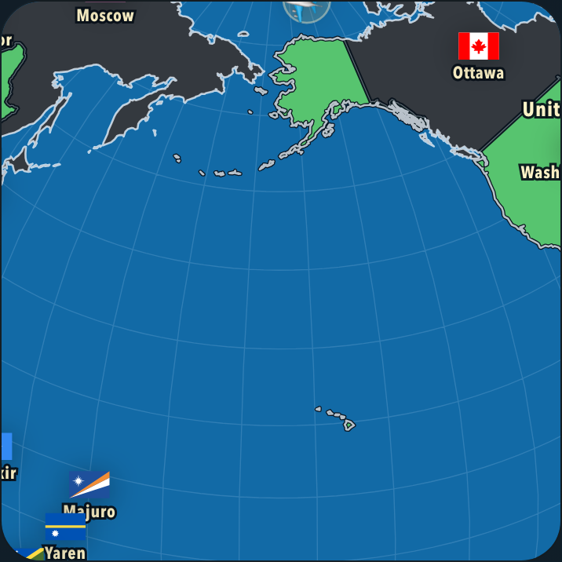
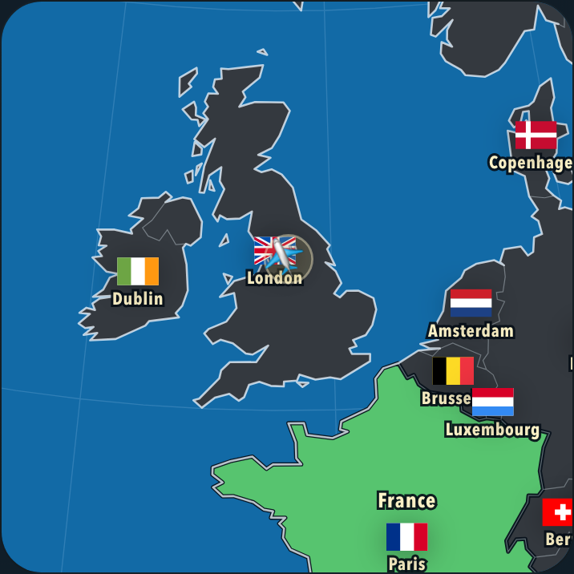

# Zoom-dependent map detail

Follow-up experiments on `codex/adaptive-rendering-experiments`, 10 September 2026. Based on commit `01842d5`; all new behavior remains opt-in. The ordinary URL retains the shipped renderer.

**Zoom-dependent detail is a better candidate than the previous fixed coarse map.** A one-CSS-pixel geometry target improved USA → China by about 29% while retaining the exact current flight geometry in the close British and Caribbean views. The best combined prototype also measures FPS, so fast devices keep the existing geometry. It is ready for comparison on the actual old phone; this is not a claim of a 30% overall gain or pixel-identical animation.

## Results

Production builds, Chromium 145.0.7632.6 on Apple M4, phone viewport 390 × 844, DPR 2. Slow-device runs use 6× CPU throttling. The route set is GBR → USA → CHN → USA → AUS → GBR, after two warmup flights. Each flight lasts 1.7 seconds. Processes, builds and visual checks ran separately from timing benchmarks.

The ordinary-flight comparison combines three repetitions in control-first order with three more in candidate-first order. This guards against treating a change in host speed as an optimization. The results are weighted by sampled time, not averaged route FPS.

| Scenario | Current SVG | One-pixel zoom LOD | Change |
| --- | ---: | ---: | ---: |
| USA → China, ordinary flights | 17.16 FPS | 22.19 FPS | +29% |
| Entire route set, ordinary flights | 27.12 FPS | 30.60 FPS | +13% |
| Entire route set, starting each flight at whole-planet zoom | 20.40 FPS | 24.97 FPS | +22% |
| USA → China, 100 answered countries | 12.86 FPS | 16.66 FPS | +29% |
| Entire route set, 100 answered countries | 21.48 FPS | 22.80 FPS | +6% |

The ordinary-flight 95th-percentile frame interval fell from 67.0 to 50.8 ms. The difficult flight still runs below 30 FPS in the throttled test. Late-game gains are concentrated on wide flights; close-view and label work still costs time.

The combined FPS/zoom variant measured 30.39 FPS overall and 22.11 FPS for USA → China in two further slow-device repetitions. It used zoom LOD for 377 frames and the exact current flight geometry for 160 close-view frames. On the unthrottled M4, it delivered about 59.6 FPS and retained standard geometry for **all 1,032 recorded frames**. The unthrottled control was about 59.7 FPS. Warmups exercise the controller before the repeated benchmark; a separate cold-flight check verifies it can switch after starting at standard detail.

A two-pixel target gave a little more speed on USA → China, but did not consistently improve the whole route set and visibly straightened some coastlines. A half-pixel target gave almost no benefit in the initial runs. Deriving LOD from the full 10m settled map improved flight detail but remained slower than the shipped 50m-derived flight geometry. The recommended candidate therefore bounds *additional* error relative to the existing flight map.

Complete per-route values, repeat variability, actual level selection, and frame-time tails are in [results.json](zoom-detail/results.json). Raw frame samples are saved under `output/playwright/zoom-*.json`.

## Selection and geometry

The prototype uses actual projection scale in CSS pixels per unit sphere, rather than a nominal zoom number. That accounts for both camera zoom and viewport size. Levels are computed in advance; nothing is simplified during animation.

For the standard flight atlas, six levels retain 7,047–15,587 arc vertices, compared with 19,258 in the source. Whole-planet views can use the smallest levels. USA → China typically uses the 11,111-vertex level. Close views return to the source geometry rather than constructing a nearly identical extra level. Full settled-map detail still returns on landing or interruption.

Simplification happens in unit-sphere 3D using a distance bound that includes the curvature of both original edges and replacement great-circle arcs. Orthographic projection is a rotation followed by a scaled linear projection: multiplying the 3D bound by the current projection scale gives the geometry error target in CSS pixels. The generator retains exact source vertices, shares arcs between neighboring regions, preserves all rings and their winding, and prevents islands from collapsing to lines. It does not claim to prove the absence of every possible geometric self-intersection.

The selector refines immediately when a level would exceed the error target. It requires 15% headroom before moving to a coarser level, reducing toggling around thresholds. Levels that retain more than 90% of source vertices are omitted: at that scale, the renderer uses the exact source.

`svg-zoom-adaptive` combines that selector with measured frame intervals. It starts with standard geometry and enables zoom LOD after two consecutive intervals above 38 ms. The one-pixel geometry target still applies at every zoom; FPS pressure cannot override it. Recovery to standard geometry is considered between completed flights using the existing conservative timing policy. Thus the fast-device path retains the original flight appearance, while close views also retain it on slow devices.

## Visual interpretation

One CSS pixel is two physical pixels in these DPR-2 captures. The target describes spherical geometry before D3's resampling, clipping, SVG rounding and rasterization; it is **not** a guarantee that every output pixel stays within one pixel of its reference. The visual measurement script independently compares the actual displayed coastline and border segments in both directions, sampling at most half a CSS pixel apart.

The test scenes include a whole-planet view, the wide Pacific flight, close Britain, the Caribbean and landing. Labels, flags and the plane are checked for exact SVG equality across variants. Their positions and sharpness are unchanged.

For the final one-pixel candidate, the largest sampled visible coastline difference was **0.86 CSS pixels** in the Pacific view; its 99th percentile was 0.65 pixels. The whole-planet view's maximum was 0.66 pixels. Close Britain, the Caribbean and landing had zero coastline/border differences, and their screenshot PNGs were byte-for-byte identical to the control. The two-pixel candidate reached 2.10 pixels in the Pacific view, supporting the choice of the stricter setting. These are measured scenes, not a universal clipping/rasterization bound; [error.json](zoom-detail/error.json) contains both directions of the comparison.

| Current flight map | One-pixel zoom-dependent map |
| --- | --- |
|  |  |
|  |  |

## Try and reproduce

After building or starting this branch locally, append one of these query parameters to `/country_quiz/`:

| Parameter | Purpose |
| --- | --- |
| `?renderExperiment=svg-zoom-adaptive` | Recommended comparison: FPS detection plus a one-pixel zoom target |
| `?renderExperiment=svg-zoom-standard-1` | Always use zoom-dependent flight geometry with a one-pixel target |
| `?renderExperiment=svg-zoom-standard-05` | Stricter half-pixel target |
| `?renderExperiment=svg-zoom-standard-2` | More permissive two-pixel target |
| `?renderExperiment=svg-zoom-1` | One-pixel target relative to the full settled map, for fidelity comparison |
| `?renderExperiment=svg-standard` | Instrumented control |

These experiments apply to orthographic flights. Flat maps, settled maps and interruption restoration retain their corresponding source renderers. The labels and interaction geometry retain the original source throughout.

```sh
node scripts/generate-zoom-lod.mjs
node scripts/verify-zoom-detail.mjs
npm run build
MATRIX=all node scripts/benchmark-zoom-detail.mjs
node scripts/summarize-zoom-detail.mjs

VARIANTS='svg-standard,svg-zoom-standard-1,svg-zoom-standard-2' \
  OVERVIEW=1 GEOMETRY=1 VISUAL_OUTPUT=output/playwright/zoom-visual \
  node scripts/experiment-render-visuals.mjs
node scripts/measure-zoom-visual-error.mjs

VARIANTS=',svg-zoom-standard-1,svg-zoom-standard-2,svg-zoom-1,svg-zoom-adaptive' \
  ADAPTIVE_VARIANT=svg-zoom-adaptive RESULT_NAME=zoom-lifecycle \
  node scripts/verify-render-experiments.mjs
node scripts/measure-zoom-preparation.mjs
```

Use Node 22.18+ for the direct TypeScript verification scripts. Regenerate the LOD files whenever either source atlas changes; source-hash checks enforce this during verification. The generator writes compact retained-vertex indices, reusing the atlas coordinates already downloaded by the app. The standard experiment adds about 28 KB gzipped of indices. Those data are fetched only for an enabled zoom experiment, and all geometry/culling caches are prepared before animation.

There is a startup/memory cost. In one cold-load diagnostic with CPU throttling already enabled, the combined prototype spent about **0.82 seconds** preparing its extra atlases, and retained about **15 MB** more JS heap after garbage collection (43.1 MB versus 28.6 MB for the control). Local-page readiness was 2.50 seconds versus 1.72 seconds. The full-source experiment was more expensive again. These are single-run diagnostics rather than startup benchmarks; [preparation.json](zoom-detail/preparation.json) records the values. Before production use, reducing that preparation cost is worthwhile, especially for devices that never need LOD.

Verification passed 34,929 arc checks, 1,134,504 independent sampled spherical-curve checks, 31,124 ring checks and 7,200 zoom-policy selections, including hysteresis. Browser lifecycle checks compare 32 exact settled SVG states after landing, zoom/pointer interruption, drag, projection changes and resize. A cold flight verifies that FPS-triggered LOD respects the zoom error target.

With experiments disabled, 150 SVG states matched the preceding branch build across desktop, mobile, 100-answer, overview, route, Mercator and Equal Earth scenarios. The existing visual verifier passed 66 screenshot comparisons; one case had Chromium raster differences despite byte-identical SVG and CSS, which the verifier checks explicitly before accepting it. [Default verification results](zoom-detail/default-verification.json) record that distinction.

## Scope of the conclusion

Desktop CPU throttling does not reproduce an old phone's GPU, memory bandwidth or thermal behavior. The improvements are repeatable on this host and the zoom rule avoids the earlier close-view distortion, but a real-phone comparison remains the deciding test for perceived smoothness and fidelity. Extra geometry preparation and memory are also costs to consider before production use.

The next useful comparison is the current game against `svg-zoom-adaptive` on the actual old phone. Keep the one-pixel target as the starting point. This branch has not been merged or deployed.
